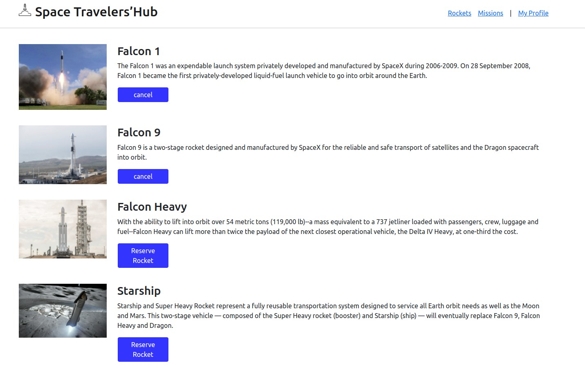
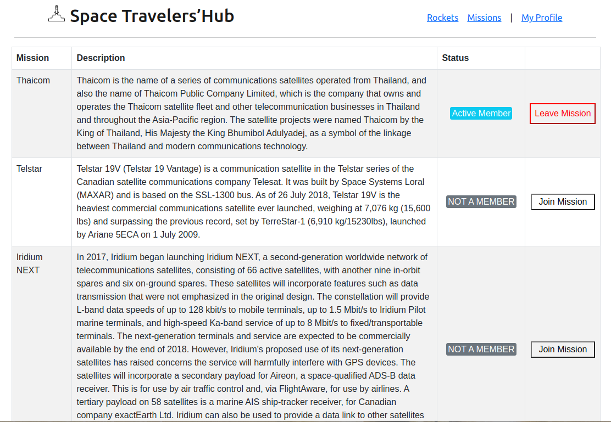
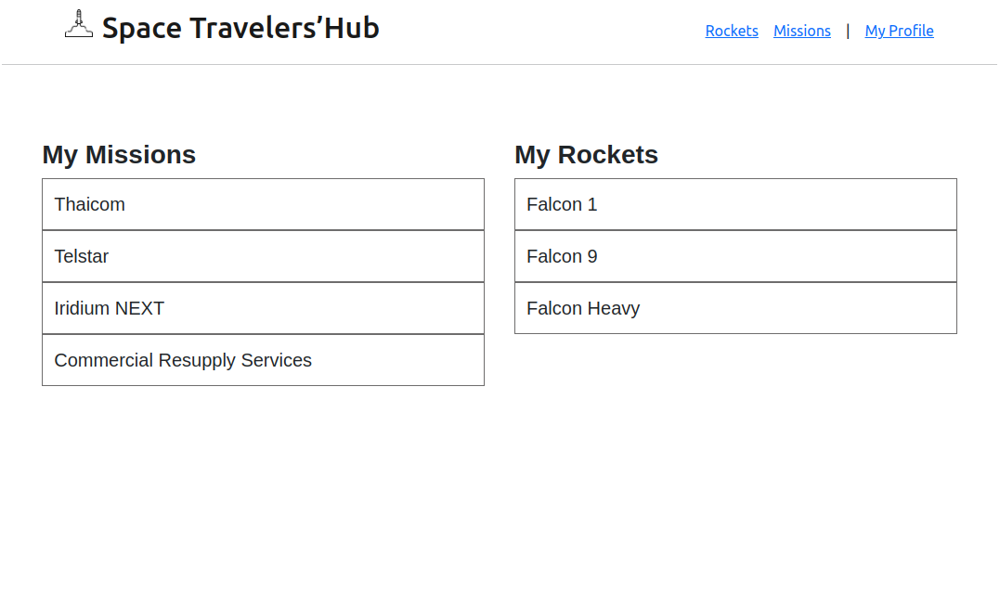

# SpaceTravellers

In this project, we will be working with the real live data from the SpaceX API. We will build a web application for a company that provides commercial and scientific space travel services. The application will allow users to book rockets and join selected space missions.

## Built With

- HTML, CSS, Javascript
- React, Redux, React-Bootstrap
- VsCode.

## Live Demo

[Live Demo Link](https://space-travelers-mehdi-rh.netlify.app/)

## Getting Started

npm i
npm start

### Run tests

npm test
### Deployment

Deployment [link](https://space-travelers-mehdi-rh.netlify.app/)
Guideline used for [deployment](https://stackabuse.com/guide-to-deploying-a-react-app-to-netlify/)

## Authors

👤 **Mehdi Rahal**

- GitHub: [@Mehdi-Rh](https://github.com/Mehdi-Rh)
- Twitter: [@MRahal92](https://twitter.com/MRahal92)
- LinkedIn: [mehdi-rahal22](https://www.linkedin.com/in/mehdi-rahal22/)

👤 **Author2**

- GitHub: [@Kayonga99](https://github.com/Kayonga99)
- Twitter: [@KayongaChiteta3](https://twitter.com/KayongaChiteta3?t=gfILCjmltzGRZOx6FZ8-nQ&s=08)
- LinkedIn: [Kayonga (KC) Chiteta](https://www.linkedin.com/in/kayonga-chiteta-776949227/)

## 🤝 Contributing

Contributions, issues, and feature requests are welcome!

Feel free to check the [issues page](../../issues/).

## Show your support

Give a ⭐️ if you like this project!

## 📝 License

This project is [MIT](./MIT.md) licensed.